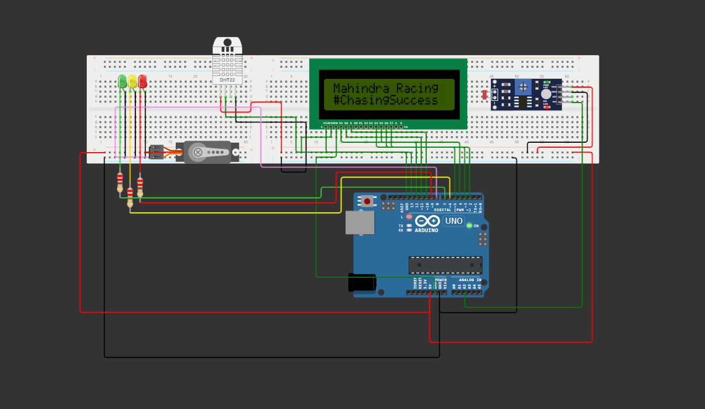

# SPRINT 1 - TECH MAHINDRA E FIAP

Este projeto foi desenvolvido como parte da __Sprint 1__ da disciplina de __Edge Computing & Computer Systems__, ministrada pelo Prof. Flávio Grassi, para os alunos do primeiro semestre de __Engenharia de Software da FIAP__. O objetivo principal dessa Sprint foi desenvolver uma solução IoT que fosse capaz de captar informações sobre a Fórmula E, transmitindo-as de maneira criativa e acessível, permitindo que pessoas de todas as idades e níveis de conhecimento sobre automobilismo se envolvam e se emocionem com a competição.

  
  

## Descrição do Projeto

O projeto consiste em um dispositivo integrado ao cockpit dos carros da Fórmula E, projetado para monitorar e alertar sobre condições adversas dentro do mesmo, tais como __temperatura, umidade e luminosidade__. Além disso, o sistema possui a funcionalidade de abrir automaticamente um compartimento de ventilação e resfriamento para melhorar as condições internas do veículo. Por meio desse dispositivo IoT integrado ao cockpit do piloto, informações cruciais são captadas e processadas em tempo real, garantindo a segurança e o conforto do piloto durante a corrida.

  

## Funcionalidades Principais do Sistema

- Monitoramento da temperatura, umidade e luminosidade dentro do cockpit.
- Abertura automática do compartimento de ventilação e resfriamento em caso de temperatura elevada.
- Exibição das informações de temperatura e umidade em um display LCD.
- Indicação visual de alertas por meio de LEDs de diferentes cores.
- Controle de um servomotor para abrir e fechar o compartimento de ventilação e resfriamento.

## Nosso Objetivo

__Você sabia que um carro de Fórmula E pode chegar a temperaturas internas de até 60°C?__ A segurança dos pilotos é de extrema importância em corridas de alta velocidade como a Fórmula E. Condições adversas dentro do cockpit, como altas temperaturas e umidade, podem afetar negativamente o desempenho do piloto e até mesmo colocar sua vida em risco. Portanto, a implementação de um sistema inteligente de monitoramento e controle é essencial para garantir um ambiente seguro e confortável durante a corrida.

 

  

## Componentes
### Lista de dispositivos utilizados nesse sistema:
- Um sensor de luz (fotoresistor) para medir a luminosidade ambiente.
- Um sensor de temperatura e umidade DHT22 para medir as condições dentro do cockpit.
- Três LEDs (vermelho, amarelo e verde) para indicar diferentes níveis de alerta.
- Um servomotor para abrir e fechar automaticamente o sistema de ventilação e resfriamento do cockpit.
- Um display LCD para exibir as informações ao piloto.
- Um Arduino Uno R3 para controlar todos os componentes.

## Instalação e Uso

### Para utilizar o sistema, siga as etapas abaixo:
1. Monte os componentes seguindo a imagem fornecida pelo circuito ou através do link do [simulador](https://wokwi.com/projects/398254614654249985) no Wokwi.
2. Carregue o código-fonte para o Arduino Uno R3.
3. Ligue o sistema e monitore as condições ambientais durante a corrida.

Certifique-se de conectar bem todos os componentes ao Arduino.

## Circuito Final

## Créditos

### Gostaríamos de agradecer à __FIAP__, à __Tech Mahindra__ e ao nosso professor pela oportunidade incrível de realizar esse projeto e também aos participantes desse trabalho.
- Prof. Flávio Grassi PF2013
- Arthur Cotrick Pagani RM554510
- Diogo Leles Franciulli RM558487
- Felipe Sousa de Oliveira RM559085
- Ryan Brito Pereira Ramos RM554497

## Referências
- [Link do Circuito](https://wokwi.com/projects/398254614654249985)
- [Vídeo da Explicação do Código]()

## Licença

Este projeto está licenciado sob a [MIT License](LICENSE).

## Direitos Reservados

Todos os direitos reservados à FIAP.
